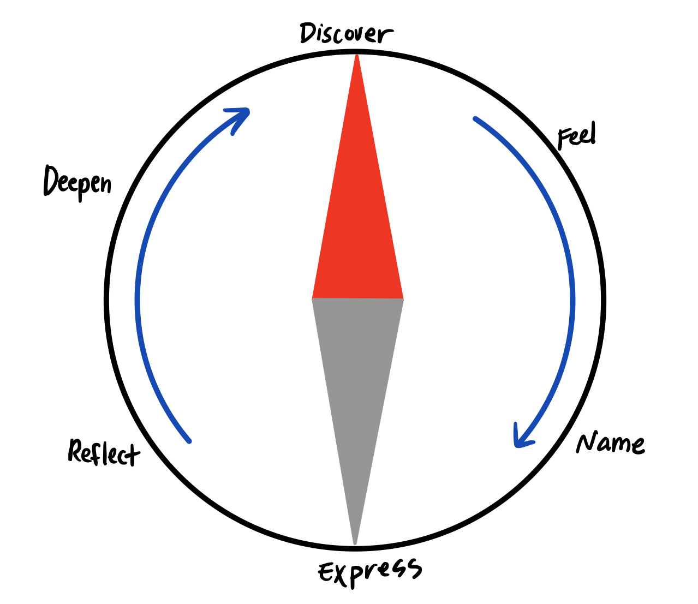
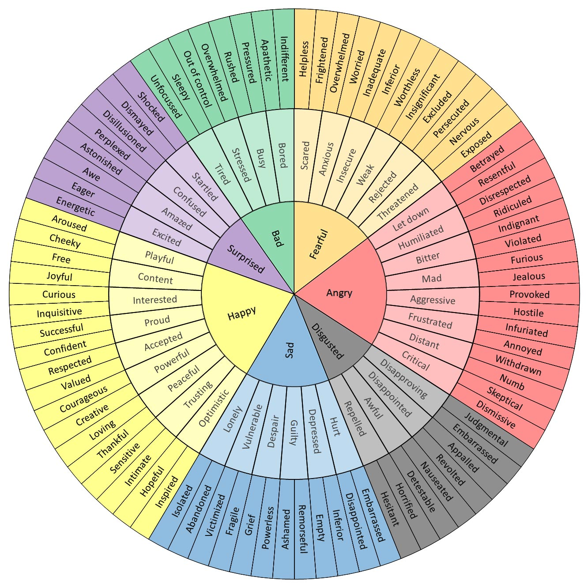

# The Discovery Cycle

This is the discovery cycle:

##### {width=500}

I've drawn it to look like a compass to remind myself of it's purpose: to lead me to where I want to be. It's made up of 6 steps, which I'll explain below:

1. **Discover:** try new things
2. **Feel:** notice how you feel when you try new things
3. **Name:** name the feelings you experience
4. **Express:** express the feeling in healthy, ethical way
5. **Reflect:** reflect on your north star. Which new things make you feel the best?
6. **Deepen:** develop and deepen the things which bring you closer to your north star.

## Discover

Try new things *all the time*. Experiment constantly. The purpose of this is to notice which things work and which things don't. Things work when they make you feel good. By constantly discovering new things, you learn not only about the world around you, but you learn about *yourself*. 

If you don't know what things to try, think back to the principles of stoicism: Let your fears guide you to your next discovery. [The obstacle in your path IS the path](/blog/stoicism/#turn-the-obstacle-upside-down).

## Feel

The discovery process will trigger feelings within you. Pay attention to these feelings because they are the measure of your discoveries. Let the feeling wash over your whole body, so you become familiar with it. Become familiar with all feelings, good or bad.

## Name

Naming the feeling gives you power over it. If you can't name it, it's completely out of your control. Naming your feelings also helps communicate them to those who are important to you. Naming prevents confusion and frustration. The more feelings you name, the clearer your thinking becomes. Here's a graph of common feelings that may help you:

## Express

Naming feelings is good, but expressing a feeling ensures that it won't fester in your body. Expression is the cure for "undead feelings". Undead feelings are ones which you've buried deep but still find ways to stay alive. Undead feelings never die and always come back to bite you hard. Always remember to express your feelings in a morally ethical way (no violence or unhealthy behaviors).

## Reflect

At this point, think about  your North Star. The North Star is what should guide every action you take in some way or another. Here's how to find it: as you feel and name and express emotions, also ask the question "why?" "Why am I feeling this way?" Keep asking why until you say "just because!" Write down that answer for safe keeping. These root-level causes are what drive you. Plan your life around these drives. There are usually about one or two root-level causes. 

Your North Star is important because having one gives you a direction. No matter how slow you're traveling, you will still be motivated to keep going as long as you're headed in the right direction.

## Deepen

Develop and deepen the activities which you think bring you closer to your North Star. These are the activities that usually give you the most joy and fullfilment. Developing and deepening your skills in a certain activity will also open more opportunities to discover new things. And so the cycle continues...

## Repeat

Continuously **discover, feel, name, express, reflect, and deepen**. These steps will help you to form two things:

1. A North Star. This is the ultimate direction that you want your life to head towards.
2. A compass. A compass helps you orient your current position. 

These are the only two things required to get to where you need to be. It's going to take a lot of effort. You'll get there.