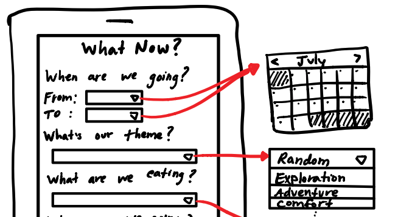

# What's Max Up to Now?

Right now, I'm in the midst of a few different things:

**TripPlanner:** I'm going through the process of creating a whole new app from scratch. I want to practice the steps all the way from idea to full product. Who knows, maybe it will be a great success! [Here's](https://github.com/maxpaulus43/trip-planner-frontend) the link to the GitHub. I'm working on it with my pal [Chris](http://www.chris-squared.xyz/). And here's a sneak into the UI mocks I drew myself!:

**Chinese:** I'm also trying to learn conversational Chinese. It's damn hard, but the [Hello Chinese](http://www.hellochinese.cc/) app makes it bearable. I try to at least one hour per day on it. I'm up to 50 characters learned and 180 words learned. :speech_balloon: :cn: 

**Reading:** I've been unable to satisfy my appetite for fiction lately. No matter what I read, I need more. In the last 5 weeks, I've read 6 books.

1. Exhalation
2. The Three Body Problem
3. Circe
4. A Court of Thorns and Roses
5. The Outsider
6. A Court of Mist and Fury

Please [contact me](/#contact-me) if you have any good recommendations!

