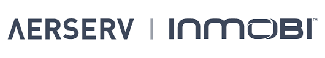

# Aerserv/Inmobi

Aerserv was my first job outside of college. Aerserv was a small(ish) advertising platform.

## Projects

I took part in a few important projects here:

### SDKV3 / Open Auction

Skills: Java, AWS

### Aerserv/Inmobi Integration

Skills: Java, AWS, GitHub, Jenkins, Spring Framework, working with team across different timezones, documentation, 

### Direct Campaigns

Skills: VueJs, Ruby Rails, Restful APIs, HTML, CSS, javascript, JQuery

